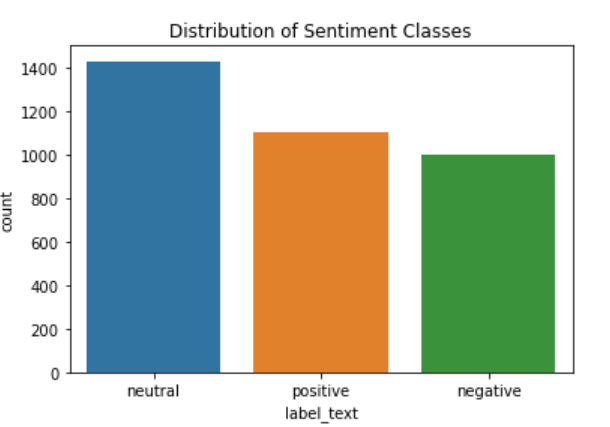
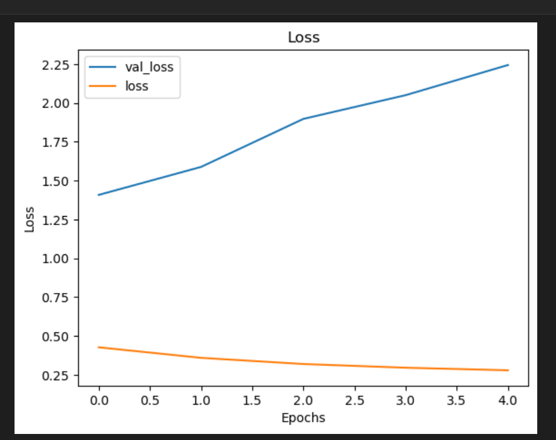
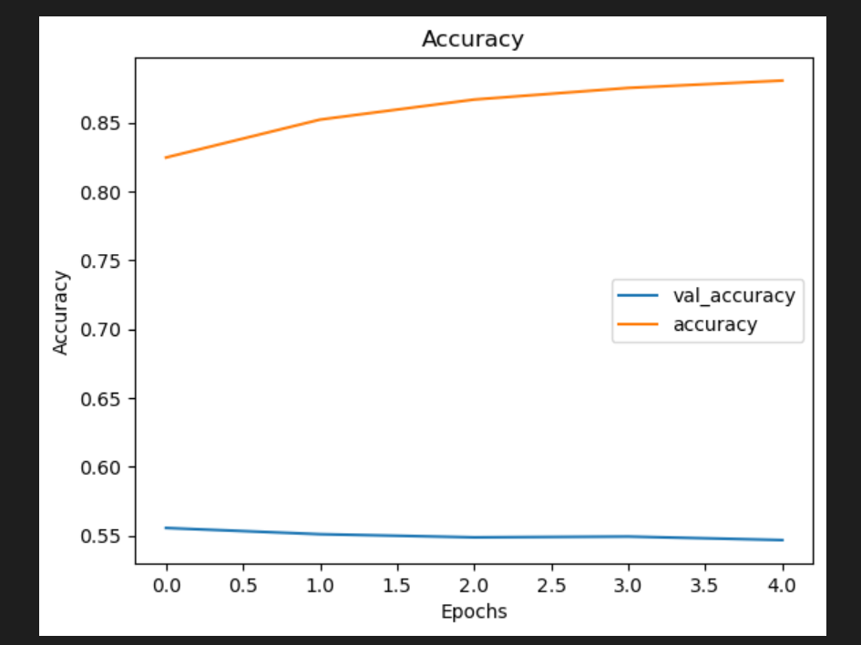
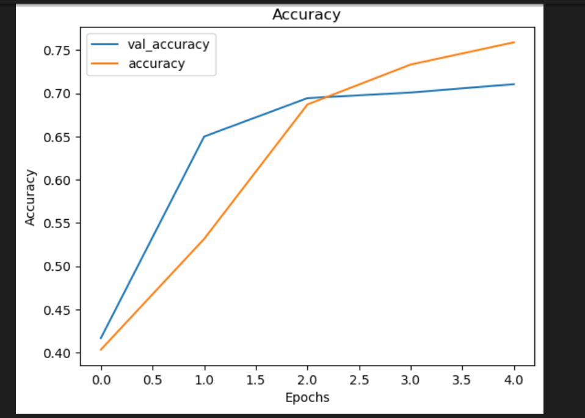

# X Sentiment Analysis Using CNN

## Introduction

Sentiment analysis is a technique used to determine the emotional tone from remarks or comments that users of certain application either X, facebook, instagram or tiktok about a certain topic.

This remarks can have a positive tone, neutral tone and negative tone towards a certain audience.

## Business Understanding

### Background

The way individuals engage and communicate has changed dramatically as a result of the social media sites like X (previously Twitter) growing so quickly. These platforms are being used more and more as a gauge of public sentiment on a range of issues, including goods and services. Businesses frequently use social media to assess customer opinion and guide their marketing initiatives.

However, there are many obstacles in the way of gleaning valuable insights from social media data. The amount of content combined with its informal and frequently colloquial style makes it challenging for computers to comprehend and process. Slang, acronyms, and emoticons can all be used to make sentiment analysis more difficult.

Principal Difficulties in Sentiment Analysis of Social Media:
1. Informal Language: Slang, acronyms, and emoticons are examples of the informal language used in social media posts, which can make it challenging for computers to understand what is being said.

2. Ambiguity: Posts on social media are not exempt from the inherent ambiguity of human language. Depending on the context, one word or phrase can mean different things to different people.

3. Subjectivity: Personal prejudices, cultural disparities, and other elements can all have an impact on sentiment. It might be difficult for computers to fully represent the subtleties of human emotions.

### Problem statement
X or formerly known as twitter is a growing social media platform, that many of its users use to make their opinions based on the topic of discussion. These opinions might be negative, positive and neutral depending on how people perceive it. As a business, sometimes corporations tend to advertise their products on this social media platform in order to get public opinion regarding on the product been advertised.

Users of this platform write their opinions the way they want to and sometimes it is challenging to get useful data from the tweets because of the sheer number and informal style, which frequently includes slang, acronyms, and emoticons. Many corporations rely on using computers as the easiest and fastest way of retrieving useful data instead of human labor.

Sometimes the computer cannot comprehend the tweets because of their informal style and make it difficult to fetch useful data needed by the corporations. Another issue is that computers cannot differentiate between positive, negative or neutral tweets just based on input text alone as that is only perceived by humans alone. This leads to inadequate insights generated by corporations from public opinion to improve certain products or when advertising certain products.

### Objective

1. Develop a sentiment analysis model that uses natural preprocessing language(nlp) to preprocess and clean the tweets, and make it in a more structured format for sentiment analysis.

2. Use the sentiment analysis model that can accurately classify tweets into positive, negative and neutral sentiment categories.

3. Evaluate Performance: Measure the model's accuracy, precision, recall, and F1-score on a labeled dataset, and iteratively improve based on evaluation results.

### Conclusion
More advanced sentiment analysis methods must be developed due to the increasing complexity of social media data. Computers can be efficient and scalable, but they frequently have trouble capturing the subtleties of human emotion and language. Researchers and companies need to invest in cutting-edge algorithms and models that can comprehend the subjectivity, tone, and context of social media posts in order to get beyond these restrictions. Organizations may improve their marketing tactics, make better judgements, and obtain deeper insights into public opinion by developing their sentiment analysis capabilities.

## Data Undarsatnding

In this section, we delve into the dataset used for sentiment analysis, examining its structure, content, and relevant statistics to better understand the information it contains and how it can be leveraged for model training.

### Dataset Overview

The dataset comprises tweets extracted from the social media platform X (formerly Twitter), labeled with three sentiment categories: positive, negative, and neutral. The objective is to classify these tweets into their respective categories based on the sentiment expressed.

### Data Structure
The dataset consists of the following columns:

- id: A unique identifier for each tweet.

- text: The content of the tweet, which may contain slang, emojis, and informal language typical of social media interactions.

- label: A numerical representation of the sentiment, where:

    0- represents negative sentiment

    1- represents neutral sentiment

    2- represents positive sentiment

- label_text: A textual representation of the sentiment label (i.e., "positive", "negative", "neutral").

### Summary Statistics

An overview of the dataset reveals key statistics regarding the number of entries and class distribution:

Total number of tweets: 27481

Class Distribution:

    Neutral: 11118

    Negative: 7781

    Positive: 8582

**Class Distribution**

This bar chart illustrates the distribution of sentiment classes in the dataset. We observe that the dataset is slightly imbalanced, with more neutral tweets compared to positive and negative tweets.

Test data

This bar chart illustrates the distribution of sentiment classes in the dataset. We observe that the dataset is slightly imbalanced, with more neutral tweets compared to positive and negative tweets.

## Data Preparation

### Text Preprocessing

The text preprocessing step aims to clean the raw text data to ensure it is in a suitable format for modeling. This involves:

- Lowercasing all the text to ensure uniformity.

- Removing special characters, punctuation, and URLs that are not useful for sentiment classification.

- Tokenization, where each tweet is broken down into individual words or tokens.

- Stopwords removal, eliminating common words (like "the", "is", etc.) that don't carry much semantic value.

- Regular expressions, to remove html tags, elongated words, possessives, mentions, html links and contractions.

- Padding, where we ensure that each sequence (tweet) has the same length by adding zeros to shorter tweets or truncating longer ones. This helps standardize the input for machine learning models.

### Tokenization and Padding

After preprocessing, we convert the cleaned text data into sequences of numerical tokens using a tokenizer. Each word in the dataset is assigned a unique integer value. This transformation allows us to feed the data into machine learning models.

Given that tweet lengths can vary significantly, we apply padding to make all sequences uniform.

**Distribution of Sequence Lengths**.

For the train data

The histogram shows the distribution of tweet lengths in terms of the number of tokens. Most tweets in the dataset contain fewer than 10 tokens, with the majority being between 5 and 10 tokens long.

For the test data

### CNN Modeling
#### Baseline Model

The validation loss and the training loss are decreasing overtime showing that the model is improving.

The validation accuracy and the training accuracy are both increasing overtime showing that the model is improving in terms of its accuracy on the training data.

Test Loss: 1.5941
Test Accuracy: 67.43%

The baseline model is better compared to the second model as it has a higher testing accuracy and a higher training accuracy.

#### Model 2

Test Loss: 2.2444
Test Accuracy: 54.67%

Model 2 had a lower test compared to the baseline model. 

From this visualization, the validation loss is increasing as the training loss is decreasing. With the validation loss increasing, this is an indication that the model is overfitting.

From this visualization, the training accuracy is increasing while the validation accuracy is decreasing. This is also shows that the model is overfitting on the training data. 

#### Model 3

From this visualization, the validation loss and the training loss are decreasing overtime showing that the model is improving.

From this visualization, the validation accuracy and the training accuracy are both increasing overtime showing that the model is improving in terms of its accuracy on the training data.

Test Loss: 0.7596
Test Accuracy: 71.05%

Model 3(third_model) is the best performing model among the three models build.

It proves its top perfomance by having a low Test Loss(0.7596) and a high Test Accuracy(71.05%) overall.

#### Conclusion
After picking our final model model3, the model was tested on new unseen data and it was able to classify positive tweets as positive, negative tweets as negative and neutral tweets as neutral.

